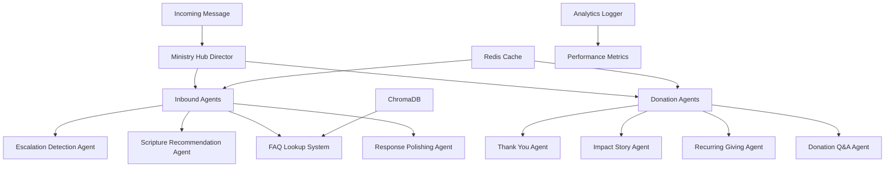

# Ministry Response System - AI-Powered with Swarms Framework

> **Professional AI-driven ministry communication system** that provides intelligent, contextual responses to inbound messages while maintaining pastoral care standards.

[](https://python.org)
[](https://fastapi.tiangolo.com)
[](https://github.com/kyegomez/swarms)
[](LICENSE)

## 🎯 Overview

This system automates ministry response workflows using advanced AI agents that:
- **Detect sensitive content** requiring human intervention
- **Recommend contextual scripture** for spiritual guidance  
- **Generate pastoral responses** in Dr. Myles' authentic voice
- **Process FAQ inquiries** with enhanced, personalized answers
- **🆕 Generate personalized donor thank-you messages**
- **🆕 Share compelling ministry impact stories**
- **🆕 Promote recurring giving with biblical stewardship**
- **🆕 Answer donation and tax-related questions**

**Built for scale** with Redis caching, async processing, and comprehensive monitoring.

---

## 🏗️ Architecture



### Core Components

| Component | Purpose | Technology |
|-----------|---------|------------|
| **Ministry Hub** | Central director routing requests | FastAPI + Swarms |
| **Escalation Agent** | Identifies sensitive topics | Swarms + GPT-3.5 |
| **Scripture Agent** | Contextual verse recommendations | Swarms + GPT-3.5 |
| **Tone Agent** | Dr. Myles pastoral voice | Swarms + GPT-3.5 |
| **FAQ System** | Semantic search & enhancement | ChromaDB + Swarms |
| **🆕 Thank You Agent** | Personalized donor appreciation | Swarms + GPT-3.5 |
| **🆕 Impact Story Agent** | Ministry achievement narratives | Swarms + GPT-3.5 |
| **🆕 Recurring Giving Agent** | Stewardship promotion | Swarms + GPT-3.5 |
| **🆕 Donation Q&A Agent** | Tax and giving questions | Swarms + GPT-3.5 |
| **Caching Layer** | Performance optimization | Redis |
| **API Gateway** | RESTful endpoints | FastAPI |

---

## 🚀 Quick Start

### Prerequisites
- Python 3.8+
- Redis Server
- OpenAI API Key

### Installation

```bash
# 1. Clone repository
git clone https://github.com/Sage-Nwanne/inbound_ministry_agent_system.git
cd inbound_ministry_agent_system

# 2. Install dependencies
pip install -r requirements.txt

# 3. Configure environment
cp .env.example .env
# Edit .env with your OpenAI API key

# 4. Start Redis
redis-server

# 5. Launch Ministry Hub
python ministry_hub_main.py
```

**Ministry Hub Available at:** `http://localhost:8000`  
**Documentation:** `http://localhost:8000/docs`

---

## 📡 API Reference

### 🆕 **Ministry Hub Endpoints**

#### Combined Hub Root
```http
GET /
```

**Response:**
```json
{
  "service": "Ministry AI Hub",
  "version": "1.0.0",
  "systems": {
    "inbound": "Message processing, FAQ, escalation detection",
    "donation": "Thank you messages, impact stories, recurring giving"
  },
  "endpoints": {
    "inbound": "/api/v1/inbound",
    "donation_thank_you": "/api/v1/donation/thank-you",
    "donation_impact": "/api/v1/donation/impact-story",
    "donation_recurring": "/api/v1/donation/recurring-giving",
    "donation_qa": "/api/v1/donation/question"
  }
}
```

### Inbound Message Endpoints

#### Process Ministry Message
```http
POST /api/v1/inbound
Content-Type: application/json

{
  "message": "I'm struggling with prayer",
  "user_id": "user123",
  "source": "website"
}
```

#### FAQ Lookup
```http
POST /api/v1/faq
Content-Type: application/json

{
  "question": "How do I join a small group?"
}
```

### 🆕 **Donation Engagement Endpoints**

#### Generate Thank You Message
```http
POST /api/v1/donation/thank-you
Content-Type: application/json

{
  "donor_name": "John Smith",
  "amount": "$500",
  "email": "john@example.com"
}
```

**Response:**
```json
{
  "message": "Dear John, Your generous gift of $500 fills our hearts with gratitude...",
  "donor_name": "John Smith",
  "amount": "$500",
  "response_time_ms": 1250
}
```

#### Get Impact Story
```http
POST /api/v1/donation/impact-story
Content-Type: application/json

{
  "category": "youth",
  "donor_segment": "major_donor"
}
```

#### Promote Recurring Giving
```http
POST /api/v1/donation/recurring-giving
Content-Type: application/json

{
  "donor_name": "Sarah Johnson",
  "current_amount": "$100"
}
```

#### Answer Donation Questions
```http
POST /api/v1/donation/question
Content-Type: application/json

{
  "question": "Is my donation tax deductible?",
  "donor_context": "first_time_donor"
}
```

### Monitoring Endpoints

- `GET /health` - Comprehensive health check for both systems
- `GET /api/v1/donation/health` - Donation system health
- `GET /docs` - Interactive API documentation

---

## 🧪 Testing & Development

### Test Donation Agents
```bash
# Test thank you generation
python -c "
from agents.donation_agents import send_thank_you_message
result = send_thank_you_message('John', '$100')
print(result)
"

# Test impact story
python -c "
from agents.donation_agents import share_impact_story
result = share_impact_story('youth')
print(result)
"
```

### Test Complete Hub
```bash
# Test ministry hub endpoints
curl -X POST http://localhost:8000/api/v1/donation/thank-you \
  -H "Content-Type: application/json" \
  -d '{"donor_name": "Test User", "amount": "$50"}'
```

---

## 📊 Performance & Monitoring

### 🆕 **Enhanced Caching Strategy**
- **Agent responses:** 24-hour TTL
- **Scripture recommendations:** 24-hour TTL  
- **FAQ enhancements:** 24-hour TTL
- **🆕 Impact stories:** 12-hour TTL
- **🆕 Thank you templates:** 6-hour TTL

### 🆕 **New Metrics Tracked**
- Donation engagement rates
- Thank you message generation times
- Impact story effectiveness
- Recurring giving conversion rates
- Donor question resolution rates

---

## 🚢 Deployment

### 🆕 **Ministry Hub Deployment**
```dockerfile
FROM python:3.9-slim

WORKDIR /app
COPY requirements.txt .
RUN pip install --no-cache-dir -r requirements.txt

COPY . .
EXPOSE 8000

# Run the combined ministry hub
CMD ["python", "ministry_hub_main.py"]
```

### Production Checklist
- [ ] Set `OPENAI_API_KEY` in production environment
- [ ] Configure Redis persistence and clustering
- [ ] Set up log aggregation (ELK stack recommended)
- [ ] Configure monitoring alerts for both inbound and donation systems
- [ ] Set up SSL/TLS termination
- [ ] Configure rate limiting
- [ ] Set up backup procedures for FAQ and impact story data
- [ ] **🆕 Configure donation data backup and security**
- [ ] **🆕 Set up donor privacy compliance monitoring**

---

## 🆕 **New Data Files**

### Impact Stories (`data/impact_stories.json`)
Contains ministry achievement data for generating compelling donor communications:
- Community outreach metrics
- Youth program growth
- Senior care initiatives  
- Mission support updates

### Enhanced Verses (`data/verses.json`)
Extended with giving and stewardship scriptures for donation communications.

---

## 🤝 Contributing

1. Fork the repository
2. Create feature branch (`git checkout -b feature/amazing-feature`)
3. Commit changes (`git commit -m 'Add amazing feature'`)
4. Push to branch (`git push origin feature/amazing-feature`)
5. Open Pull Request

### Development Standards
- Follow PEP 8 style guidelines
- Add unit tests for new features
- Update documentation for API changes
- Test with multiple Python versions
- **🆕 Test both inbound and donation agent functionality**

---

## 📚 Resources & Support

- **Swarms Framework:** [Documentation](https://github.com/kyegomez/swarms)
- **FastAPI Guide:** [Official Docs](https://fastapi.tiangolo.com/)
- **Redis Setup:** [Installation Guide](https://redis.io/docs/getting-started/)
- **OpenAI API:** [API Reference](https://platform.openai.com/docs)

### Support Channels
- **Issues:** [GitHub Issues](https://github.com/Sage-Nwanne/inbound_ministry_agent_system/issues)
- **Discussions:** [GitHub Discussions](https://github.com/Sage-Nwanne/inbound_ministry_agent_system/discussions)

---

## 📄 License

This project is licensed under the MIT License - see the [LICENSE](LICENSE) file for details.

---

**Version:** 2.1.0 | **Framework:** Swarms AI | **Status:** Production Ready

*Empowering ministry through intelligent automation while preserving the human touch.*


