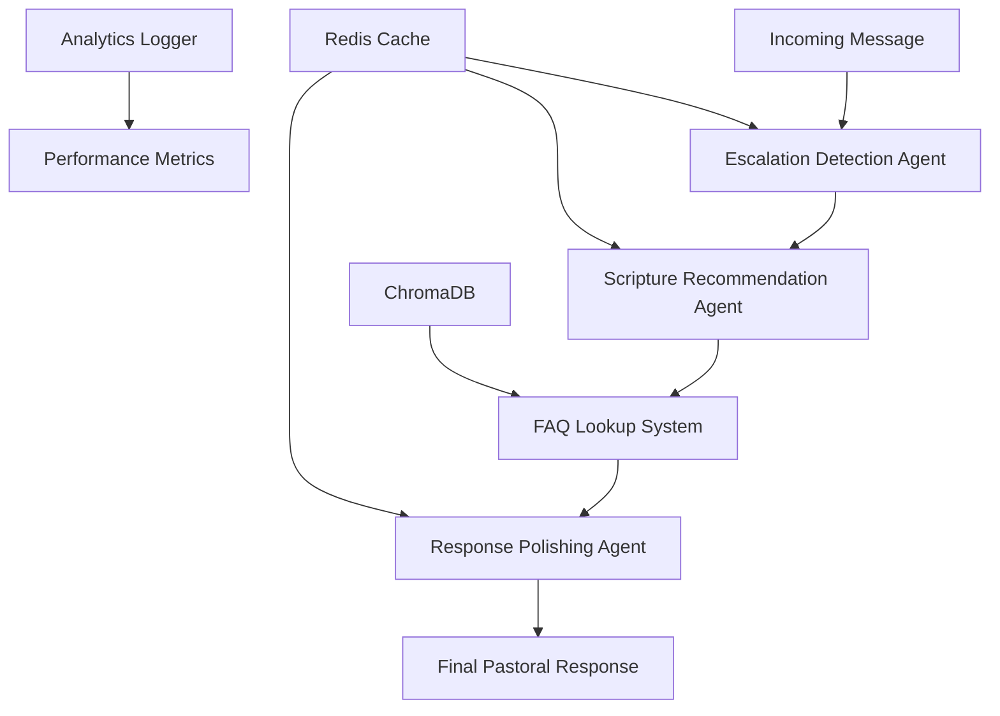

# Ministry Response System - AI-Powered with Swarms Framework

> **Professional AI-driven ministry communication system** that provides intelligent, contextual responses to inbound messages while maintaining pastoral care standards.

[](https://python.org)
[](https://fastapi.tiangolo.com)
[](https://github.com/kyegomez/swarms)
[](LICENSE)

## 🎯 Overview

This system automates ministry response workflows using advanced AI agents that:
- **Detect sensitive content** requiring human intervention
- **Recommend contextual scripture** for spiritual guidance  
- **Generate pastoral responses** in Dr. Myles' authentic voice
- **Process FAQ inquiries** with enhanced, personalized answers

**Built for scale** with Redis caching, async processing, and comprehensive monitoring.

---

## 🏗️ Architecture



### Core Components

| Component | Purpose | Technology |
|-----------|---------|------------|
| **Escalation Agent** | Identifies sensitive topics | Swarms + GPT-3.5 |
| **Scripture Agent** | Contextual verse recommendations | Swarms + GPT-3.5 |
| **Tone Agent** | Dr. Myles pastoral voice | Swarms + GPT-3.5 |
| **FAQ System** | Semantic search & enhancement | ChromaDB + Swarms |
| **Caching Layer** | Performance optimization | Redis |
| **API Gateway** | RESTful endpoints | FastAPI |

---

## 🚀 Quick Start

### Prerequisites
- Python 3.8+
- Redis Server
- OpenAI API Key

### Installation

```bash
# 1. Clone repository
git clone https://github.com/Sage-Nwanne/inbound_ministry_agent_system.git
cd inbound_ministry_agent_system

# 2. Install dependencies
pip install -r requirements.txt

# 3. Configure environment
cp .env.example .env
# Edit .env with your OpenAI API key

# 4. Start Redis
redis-server

# 5. Launch application
python main.py
```

**API Available at:** `http://localhost:8000`  
**Documentation:** `http://localhost:8000/docs`

---

## 🔧 Configuration

### Environment Variables

```env
# Required
OPENAI_API_KEY=sk-your-openai-key-here

# Redis Configuration
REDIS_HOST=localhost
REDIS_PORT=6379
REDIS_DB=0

# Optional
HOST=0.0.0.0
PORT=8000
FAQ_DATA_PATH=./data/faqs.json
```

### Agent Customization

Modify agent behavior in `agents/swarm_agents.py`:

```python
escalation_agent = Agent(
    agent_name="EscalationDetector",
    system_prompt="Your custom escalation detection prompt...",
    llm=model,
    max_loops=1,
    temperature=0.3  # Adjust for consistency
)
```

---

## 📡 API Reference

### Core Endpoints

#### Process Ministry Message
```http
POST /inbound
Content-Type: application/json

{
  "message": "I'm struggling with prayer",
  "user_id": "user123",
  "source": "website"
}
```

**Response:**
```json
{
  "reply": "Beloved, prayer can feel challenging at times. Remember Matthew 6:9-11...",
  "needs_escalation": false,
  "framework": "swarms"
}
```

#### FAQ Lookup
```http
POST /faq
Content-Type: application/json

{
  "question": "How do I join a small group?"
}
```

#### Escalation Check
```http
POST /escalation-check
Content-Type: application/json

{
  "message": "I'm having thoughts of self-harm"
}
```

### Monitoring Endpoints

- `GET /` - Health check
- `GET /analytics` - Performance metrics
- `GET /docs` - Interactive API documentation

---

## 🧪 Testing & Development

### Unit Testing
```bash
# Test individual agents
python -c "
from agents.swarm_agents import detect_escalation_swarm
result = detect_escalation_swarm('I need prayer guidance')
print(f'Escalation needed: {result}')
"
```

### Integration Testing
```bash
# Test complete workflow
python -c "
from agents.inbound_agent import inbound_agent
response, faq_matched = inbound_agent('How do I strengthen my faith?')
print(f'Response: {response[:100]}...')
print(f'FAQ matched: {faq_matched}')
"
```

### Load Testing
```bash
# Install testing tools
pip install httpx pytest

# Run load tests
python tests/load_test.py
```

---

## 📊 Performance & Monitoring

### Caching Strategy
- **Agent responses:** 24-hour TTL
- **Scripture recommendations:** 24-hour TTL  
- **FAQ enhancements:** 24-hour TTL

### Metrics Tracked
- Response times per endpoint
- Escalation rates
- FAQ match rates
- Agent performance
- Error rates

### Logging
```python
# Structured logging format
{
  "timestamp": "2024-01-15T10:30:00Z",
  "level": "INFO",
  "message": "Swarms workflow completed",
  "user_id": "user123",
  "response_time_ms": 1250,
  "escalated": false
}
```

---

## 🚢 Deployment

### Docker Deployment
```dockerfile
FROM python:3.9-slim

WORKDIR /app
COPY requirements.txt .
RUN pip install --no-cache-dir -r requirements.txt

COPY . .
EXPOSE 8000

CMD ["python", "main.py"]
```

### Production Checklist
- [ ] Set `OPENAI_API_KEY` in production environment
- [ ] Configure Redis persistence and clustering
- [ ] Set up log aggregation (ELK stack recommended)
- [ ] Configure monitoring alerts
- [ ] Set up SSL/TLS termination
- [ ] Configure rate limiting
- [ ] Set up backup procedures for FAQ data

---

## 🔒 Security Considerations

- **API Key Protection:** Never commit API keys to version control
- **Input Validation:** All user inputs are sanitized
- **Rate Limiting:** Implement per-user rate limits in production
- **Escalation Safety:** System defaults to escalation on errors
- **Data Privacy:** No sensitive user data stored in logs

---

## 🤝 Contributing

1. Fork the repository
2. Create feature branch (`git checkout -b feature/amazing-feature`)
3. Commit changes (`git commit -m 'Add amazing feature'`)
4. Push to branch (`git push origin feature/amazing-feature`)
5. Open Pull Request

### Development Standards
- Follow PEP 8 style guidelines
- Add unit tests for new features
- Update documentation for API changes
- Test with multiple Python versions

---

## 📚 Resources & Support

- **Swarms Framework:** [Documentation](https://github.com/kyegomez/swarms)
- **FastAPI Guide:** [Official Docs](https://fastapi.tiangolo.com/)
- **Redis Setup:** [Installation Guide](https://redis.io/docs/getting-started/)
- **OpenAI API:** [API Reference](https://platform.openai.com/docs)

### Support Channels
- **Issues:** [GitHub Issues](https://github.com/Sage-Nwanne/inbound_ministry_agent_system/issues)
- **Discussions:** [GitHub Discussions](https://github.com/Sage-Nwanne/inbound_ministry_agent_system/discussions)

---

## 📄 License

This project is licensed under the MIT License - see the [LICENSE](LICENSE) file for details.

---

**Version:** 2.0.0 | **Framework:** Swarms AI | **Status:** Production Ready

*Empowering ministry through intelligent automation while preserving the human touch.*


